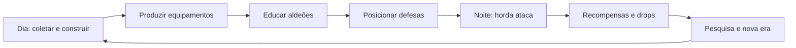
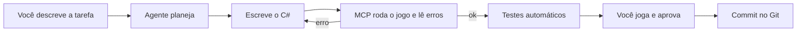

# GDD — Jogo de Automação Medieval com Defesa de Hordas

Exportado do Claude Docs em 26/09/2026. A versão oficial (viva) está no claude.ai; reexporte quando ela mudar.

## 1. Visão geral

**Pitch:** um jogo de automação estilo Factorio, só que medieval e com magia, em que cada linha de produção existe para armar, treinar e curar o exército que defende sua cidadela contra hordas que ficam mais fortes a cada noite.

**Título provisório:** *Engrenagens da Cidadela* (troque à vontade).

**Gênero:** automação + gerenciamento de colônia + base building + tower defense por ondas (waves).

**Público-alvo:** fãs de Factorio, Satisfactory e Dyson Sphere Program que gostam de otimizar, mais fãs de Stronghold, They Are Billions e Mindustry que gostam de defender uma base.

**Plataforma sugerida:** PC (Steam), mouse e teclado. 3D com câmera top-down inclinada, estilo Albion Online.

### Pilares de design

1. **Automação é o coração.** Nada de combate funciona sem uma fábrica por trás. Uma espada é o fim de uma cadeia de 5 a 10 etapas.
2. **A noite cobra a conta do dia.** O dia é para construir e otimizar; a noite testa se a fábrica aguenta a pressão.
3. **Pessoas são recursos vivos.** Aldeões são educados e equipados pela automação e viram soldados, magos e curandeiros.
4. **Fácil de entrar, quase impossível de dominar.** As primeiras noites ensinam; as últimas exigem domínio total do sistema.
5. **Medieval com fantasia controlada.** Tecnologia de água, vento e tração animal no início; alquimia e runas mágicas no fim substituem a "eletricidade".
6. **O Castelão está sempre em campo.** O jogador é um personagem, não uma câmera: coleta, constrói, luta e comanda de perto, e a câmera o segue (seção 20).

## 2. Referências e o que pegar de cada

O nicho "automação + defesa por ondas" já existe, mas quase sempre em sci-fi ou em escala pequena. Uma versão medieval, profunda e focada em transformar aldeões em exército ainda é um espaço aberto.

| Jogo | O que ele faz bem | O que pegar para o nosso jogo |
| --- | --- | --- |
| Factorio | Cadeias de produção longas, esteiras, pesquisa, inimigos que evoluem com a poluição | Árvore de pesquisa em tiers; inimigos reagindo ao tamanho da fábrica; blueprints |
| Satisfactory | Construção em 3D, verticalidade, marcos de progresso | Fábricas em vários andares dentro das muralhas; marcos ("milestones") que liberam eras |
| Dyson Sphere Program | Escala crescente e objetivo final grandioso | Um megaprojeto final (ex.: o Grande Selo Arcano) que encerra o jogo |
| [Mindustry](https://store.steampowered.com/app/1127400/Mindustry/) | Torres abastecidas por munição vinda de esteiras, ondas e unidades produzidas | Torres e soldados que consomem flechas, poções e reparos enviados pela logística |
| They Are Billions | Hordas gigantes, uma brecha perde tudo | Tensão das noites e ondas finais massivas |
| Stronghold | Castelo medieval, economia de alimentos, muralhas e cercos | Layout de castelo, portões, fossos, óleo fervente |
| Castle Story | Construção livre de castelos em blocos, noites de invasão | Muralhas moldáveis pelo jogador e ataques noturnos |
| RimWorld | Colonos com habilidades, humor e necessidades | Aldeões com atributos, moral, fome e treino |
| [Factory Town](https://gamegeeker.com/editors-picks/best-factory-automation-games-on-steam) | Logística medieval com esteiras e carrinhos | Prova de que a automação medieval funciona e é legível |
| [Tower Factory](https://store.steampowered.com/app/2707490/Tower_Factory/) | Fábrica que produz torres contra ondas, com roguelite | Concorrente direto: estudar o que falta nele (profundidade, pessoas) |
| [Mob Factory](https://store.steampowered.com/app/2182630/Mob_Factory/) | Inimigos viram recurso; poções melhoram a fábrica | Drops de monstros como insumo de alquimia |

**Diferencial do nosso jogo:** a automação não produz torres, produz *pessoas preparadas*. A cadeia termina num soldado treinado, equipado e abastecido.

## 3. Loop de gameplay

Cada ciclo tem dia (construir) e noite (defender). Sugestão inicial: dia de 12 minutos, noite de 4 a 6 minutos, com botão de pausa e velocidade 1x/2x/3x.



**Loop curto (segundos a minutos):** andar com o Castelão, colocar máquinas, ligar esteiras, resolver gargalos.

**Loop médio (um ciclo dia/noite):** preparar a defesa para a próxima horda, reparar danos, repor munição e poções.

**Loop longo (uma partida, 20 a 40 horas):** avançar pelas eras tecnológicas, crescer a vila até cidadela e vencer a noite final.

### Condições de vitória e derrota

- **Derrota:** o Coração da Cidadela (estrutura central) é destruído.
- **Vitória:** sobreviver à última noite (ex.: noite 50) e ativar o megaprojeto final.
- **Modo infinito:** após vencer, hordas continuam escalando para placar.

## 4. Sistema de automação

A automação usa tecnologia medieval plausível no início e magia no fim, substituindo a eletricidade dos jogos de referência.

### Recursos brutos

| Recurso | Fonte | Usado para |
| --- | --- | --- |
| Madeira | Lenhadores, serrarias | Construção, arcos, flechas, carvão |
| Pedra | Pedreiras | Muralhas, torres, fornos |
| Minério de ferro | Minas | Ferro, aço |
| Minério de cobre e estanho | Minas | Bronze (era inicial) |
| Carvão | Minas ou carvoarias | Combustível de forjas |
| Couro e lã | Criação de animais | Armaduras leves, cordas de arco |
| Ervas e cogumelos | Hortas e florestas | Alquimia |
| Cristais de mana | Veios raros, drops de chefes | Magia e runas |
| Essência monstruosa | Drops das hordas | Poções e encantamentos avançados |

### Logística (o que substitui as esteiras)

1. **Carregadores humanos:** lentos, primeira era.
2. **Esteiras de couro movidas a roda d'água ou moinho:** o transporte padrão.
3. **Trilhos com carrinhos de mina:** longas distâncias.
4. **Calhas e aquedutos:** transportam líquidos (água, óleo, poções base).
5. **Elevadores de guindaste:** fábricas em vários andares.
6. **Portais rúnicos:** última era, teletransporte de itens.

### Energia

| Fonte | Era | Observação |
| --- | --- | --- |
| Tração animal (bois, cavalos) | I | Precisa de comida; fraca mas barata |
| Roda d'água | I–II | Só perto de rios; estável |
| Moinho de vento | II | Varia com o clima |
| Caldeira a vapor primitiva | III | Consome carvão e água |
| Cristal de mana | IV | Forte, mas atrai monstros |

**Regra de tensão:** fontes de energia mais fortes atraem hordas maiores (como a poluição em Factorio). Crescer rápido tem custo.

## 5. Cadeias de produção

Cada item de combate nasce de uma cadeia que começa simples e ganha etapas a cada era. Os números de etapas abaixo são metas de design.

**Como as máquinas funcionam (protótipo, 25/09/2026):** cada máquina tem uma receita em `data/recipes.json` (serraria: 1 madeira → 2 hastes em 2 s; fundição: 2 ferros → 1 lingote em 3 s; forja: 2 lingotes + 1 haste → 1 espada em 5 s). Ela recebe itens de esteiras que apontam para ela (ou do Castelão, à mão), guarda até 2 ciclos de entrada, trabalha quando tem tudo e solta o produto na esteira ou baú à sua frente (a seta no chão; R gira ao construir). Com a saída cheia (5 ciclos), para. Trabalhando, mostra que está viva: a serraria gira a lâmina, fundição e forja soltam fumaça.

### Metalurgia e armas (espadas, lanças, machados)

- **Era I (3 etapas):** minério de cobre + estanho → fundição de bronze → forja → espada de bronze.
- **Era II (5 etapas):** minério de ferro → fundição → lingote → forja → afiação → espada de ferro.
- **Era III (7 etapas):** ferro + carvão → alto-forno → aço → forja → têmpera em água → afiação → cabo de couro → espada de aço.
- **Era IV (9+ etapas):** aço → forja → gravação de runas (cristal de mana) → banho alquímico → encantamento → lâmina rúnica.

### Armaduras

- **Leve:** couro curtido (curtume → corte → costura).
- **Média:** cota de malha (arame de ferro → anéis → trançado → reforço de couro).
- **Pesada:** placas de aço (lâmina de aço → martelagem → moldagem → rebites → forro de lã).
- **Arcana:** placa rúnica, exige alquimia e cristais.

### Arcos e flechas

- **Arco:** madeira de teixo → secagem → entalhe → corda (linho ou tripa) → arco.
- **Flecha:** haste (serraria) + ponta (forja) + penas (galinheiro) → montagem.
- **Flechas especiais:** incendiária (óleo), venenosa (alquimia), perfurante (aço), explosiva (pólvora alquímica).
- Flechas são **munição consumível**: arqueiros e torres precisam de reposição constante via logística.

### Alquimia e poções

| Poção | Insumos principais | Efeito |
| --- | --- | --- |
| Cura menor | Ervas + água destilada | Recupera vida |
| Cura maior | Cura menor + essência monstruosa | Cura em área |
| Fúria | Cogumelo vermelho + sangue de fera | Mais dano por tempo limitado |
| Pele de pedra | Pó de pedra + resina | Menos dano recebido |
| Fogo líquido | Óleo + enxofre | Arremessável, dano em área |
| Mana | Cristal moído + água benta | Recarrega magos |

Cadeia típica: horta → secador → moinho de ervas → alambique → misturador → engarrafamento (vidraria à parte).

### Alimentação

Aldeões e soldados comem. Trigo → moinho → padaria → pão; animais → açougue → carne; peixe; cerveja para moral. Fome derruba produtividade e moral, criando uma cadeia "invisível" que sustenta todas as outras.

## 6. Aldeões e educação

Aldeões são a "matéria-prima viva" do jogo: chegam como camponeses e a automação os transforma em especialistas.

**Origem e visual (decidido em 25/09/2026):** os aldeões vêm da mesma origem cristalina da protagonista, mas são uma versão inferior, feita para o trabalho braçal: humanoides pequenos, gordinhos, desajeitados e ingênuos, com um cristal pequeno e opaco no peito. Por trás da aparência boba há potencial: deles saem guerreiros, arqueiros, magos, clérigos, bruxos, cientistas e as demais classes.

**Regra visual das classes:** o cristal do peito é a marca da evolução. Opaco no camponês, ele ganha brilho e uma cor própria quando o aldeão se forma numa classe (ex.: vermelho para guerreiro, verde para arqueiro, roxo para mago). De cima e à noite, o jogador reconhece cada unidade pela cor do cristal.

**Regra técnica:** todas as classes usam o mesmo corpo-base com o mesmo rig e as mesmas animações; muda só roupa, acessórios, arma e cor do cristal. Isso reduz muito o trabalho de 3D e animação.

**Chegada de população:** casas e comida atraem imigrantes a cada amanhecer. Mais conforto (taverna, igreja, banhos) atrai mais gente.

**Atributos de cada aldeão:** Força, Destreza, Intelecto, Fé e Moral. Eles definem em qual classe o aldeão rende melhor.

**Trabalho básico (protótipo, 25/09/2026):** cabanas de trabalho dão ofício aos aldeões livres. Cabana do Lenhador (madeira), do Pedreiro (pedra) e do Mineiro (ferro): ao construir uma, o aldeão livre mais perto vira o trabalhador. Ele acha sozinho o recurso mais perto dentro do raio da cabana (12 células), anda até ele desviando de obstáculos, coleta até 5 itens e volta para entregar. A cabana guarda até 50 e solta na esteira ou baú à sua frente, então os aldeões alimentam a fábrica. Desmontar a cabana libera o aldeão. Números em `data/villagers.json` e `data/buildings.json`.

### Educação como linha de produção

Escolas funcionam como máquinas: recebem um aldeão + insumos + tempo e "produzem" um especialista.

| Classe | Prédio de treino | Insumos por formando | Função no combate |
| --- | --- | --- | --- |
| Miliciano | Campo de treino | Lança de madeira, comida | Linha de frente barata |
| Soldado | Quartel | Espada, armadura, escudo | Tanque e dano corpo a corpo |
| Arqueiro | Estande de tiro | Arco, flechas de treino | Dano à distância nas muralhas |
| Curandeiro | Mosteiro | Poções de cura, livros | Cura aliados, consome poções |
| Mago | Torre arcana | Pergaminhos, cristais de mana | Dano em área, consome mana |
| Alquimista | Academia alquímica | Livros, vidraria | Opera prédios de alquimia avançada |
| Engenheiro | Guilda de engenharia | Ferramentas, plantas | Opera catapultas e repara muralhas |

### Progressão das unidades

- Unidades ganham **experiência** sobrevivendo às noites (Recruta → Veterano → Elite).
- **Pergaminhos e livros** são itens produzidos pela automação (papel → tinta → escriba → livro) que aceleram o treino.
- **Equipamento é trocável:** melhorar a fábrica de espadas melhora o exército sem retreinar ninguém.
- **Manutenção:** armas desgastam e poções acabam; um arsenal abastecido automaticamente evita que o exército fique vazio no meio da noite.

## 7. Base building e fortificação

A base cresce em anéis: o Coração da Cidadela no centro, a fábrica ao redor e as muralhas por fora. Espaço dentro das muralhas é limitado, então otimizar o layout da fábrica é também uma decisão de defesa.

### Evolução do assentamento

| Estágio | Muralha | Destaque |
| --- | --- | --- |
| Acampamento | Paliçada de madeira | Fogueira central, cabanas |
| Vila | Muro de pedra baixo | Primeiras oficinas e esteiras |
| Fortaleza | Muralha alta com adarve | Torres, portões duplos, fosso |
| Cidadela | Muralhas concêntricas | Distritos industriais, torres arcanas |

### Estruturas defensivas

- **Muralhas e portões:** têm vida e precisam de reparo (pedra e engenheiros).
- **Torres de arqueiros:** guarnecidas por arqueiros treinados; consomem flechas.
- **Balistas e catapultas:** operadas por engenheiros; consomem virotes e pedras.
- **Caldeirões de óleo:** abastecidos por calhas; dano em área nos portões.
- **Armadilhas:** estacas, fossos, minas alquímicas; consumíveis produzidos na fábrica.
- **Torres arcanas:** alimentadas por cristais de mana via logística.

### Regra central

Toda defesa é um **consumidor** da fábrica. Uma torre sem flechas é só uma parede alta. Isso liga base building e automação num mesmo sistema.

## 8. Sistema de hordas

As hordas crescem por uma fórmula previsível mais modificadores, para o jogador sempre sentir que a próxima noite é mais dura, mas planejável.

### Fórmula de escalonamento (ponto de partida)

```latex
Poder_{noite} = P_0 \times 1{,}12^{n} \times (1 + 0{,}5 \times A)
```

Onde n é o número da noite, P0 o poder base e A a "aura" da cidade (0 a 1), que sobe com energia usada e tamanho da fábrica. Com esses valores, a noite 20 é cerca de 10x a noite 1, e a noite 40 cerca de 90x.

### Tipos de inimigos

| Inimigo | Aparece a partir de | Característica | Contra-ataque ideal |
| --- | --- | --- | --- |
| Goblins | Noite 1 | Muitos e fracos | Arqueiros, estacas |
| Lobos sombrios | Noite 5 | Rápidos, contornam muralhas | Portões fechados, lanceiros |
| Orcs | Noite 10 | Resistentes, derrubam portões | Óleo fervente, soldados pesados |
| Esqueletos | Noite 15 | Imunes a veneno | Armas contundentes, magia sagrada |
| Trolls | Noite 20 | Regeneram vida | Fogo líquido, flechas incendiárias |
| Espectros | Noite 25 | Atravessam muralhas | Magos, torres arcanas |
| Aríetes e cercos | Noite 30 | Atacam estruturas | Catapultas, reparo rápido |
| Dragões | Noite 40 | Voam, fogo em área | Balistas, poção anti-fogo |

### Chefes e eventos

- **Chefe a cada 10 noites**, com mecânica própria (ex.: Rei Goblin invoca reforços; Lich ressuscita mortos).
- **Luas especiais:** Lua de Sangue (horda dupla), Noite de Névoa (visão reduzida), Eclipse (só magia funciona bem).
- **Aviso prévio:** ao entardecer, um batedor revela a composição da horda, para o jogador ajustar a produção.

### IA de ataque

Inimigos procuram o caminho de menor resistência, priorizam prédios de energia e atacam o ponto mais fraco da muralha. Isso pune layouts preguiçosos.

## 9. Curva de aprendizado e progressão

A curva começa suave e fica íngreme: cada era introduz no máximo 2 conceitos novos, e só as últimas eras exigem dominar todos ao mesmo tempo.

| Era | Noites | Conceitos novos | Complexidade da cadeia | Sensação desejada |
| --- | --- | --- | --- | --- |
| I — Madeira | 1–8 | Coletar, esteiras, comida | 2–3 etapas | Tutorial, sem punição |
| II — Ferro | 9–18 | Fundição, treino de soldados | 4–5 etapas | "Estou entendendo" |
| III — Aço | 19–30 | Alquimia, líquidos, múltiplos andares | 6–8 etapas | Primeiros gargalos sérios |
| IV — Arcana | 31–42 | Mana, runas, magos, portais | 8–10 etapas | Tudo conectado, tudo importa |
| V — Cerco Final | 43–50 | Nenhum novo: otimizar tudo | 10+ etapas, grandes volumes | Só quem domina o jogo passa |

### Como manter o início fácil

- **Noites 1–3 sem derrota possível:** inimigos param nas paliçadas.
- **Tutorial contextual:** o conselheiro do castelo explica cada máquina na primeira vez que ela é desbloqueada.
- **Calculadora de produção embutida** ("quanto preciso de X por minuto?") desde a era II.

### Como tornar o fim realmente difícil

- Hordas mistas que exigem **todos** os tipos de unidade ao mesmo tempo.
- Produtos finais exigem insumos de **3 a 4 cadeias diferentes** (ex.: lâmina rúnica = aço + cristal + poção + livro).
- Consumo contínuo durante a noite: se a logística falhar no meio da batalha, a defesa cai.

### Níveis de dificuldade

**Peregrino** (história), **Cavaleiro** (padrão), **Rei** (para veteranos) e **Lenda** (fórmula de hordas com 1,15 por noite, sem aviso prévio).

## 10. Escopo, MVP e roadmap

Comece pequeno: um protótipo 3D simples (formas básicas, câmera estilo Albion) que prove que "fábrica → soldado → sobreviver à noite" é divertido, antes de qualquer arte 3D.

### MVP (protótipo jogável)

- Mapa 3D com câmera top-down inclinada (estilo Albion), modelos simples gerados por IA.
- 3 recursos (madeira, pedra, ferro), esteiras e 5 máquinas.
- 1 cadeia completa: ferro → espada → soldado.
- 1 cadeia de munição: madeira → flechas → torre de arqueiros.
- Ciclo dia/noite com 10 noites e 2 tipos de inimigo.
- O Castelão (seção 20): anda com WASD, coleta e constrói no alcance, luta nas noites e renasce no Coração.

### Roadmap sugerido

| Fase | Entrega | Meta de validação |
| --- | --- | --- |
| 1. Protótipo | MVP acima | Amigos jogam 30 min e querem continuar |
| 2. Vertical slice | Eras I–II completas, arte provisória | Curva das 18 primeiras noites testada |
| 3. Alpha | Eras III–IV, alquimia, magos | Cadeias longas sem travar o desempenho |
| 4. Beta / Early Access | Era V, chefes, balanceamento | Página na Steam, demo, feedback público |

### Desenvolvendo com IA

- **Motor:** Godot 4.7 com C# (decidido; ver seção 13). Para automação com milhares de itens, planejar desde o início a simulação separada da renderização.
- **Código:** use Claude Code para gerar sistemas isolados (esteiras, receitas, IA de inimigos) com testes.
- **Dados em planilha:** receitas, inimigos e balanceamento em arquivos JSON/CSV, para ajustar sem mexer no código.
- **Arte:** ferramentas de IA para conceitos; arte final consistente exige um estilo definido (pixel art ou low-poly são mais fáceis de manter).

## 11. Projeto feito com IA

Todo o jogo (código, modelos 3D, texturas, animações, sons e textos) será produzido com IA. O objetivo é medir até onde a IA chega hoje: entregar um jogo divertido e completo, sem a exigência de ser um sucesso comercial.

### Regras do experimento

- **O humano dirige, a IA produz.** Você define design, revisa, testa e decide; a IA escreve, modela e anima.
- **Registrar tudo:** um diário de desenvolvimento com o que a IA fez bem, onde errou e quanto custou. Esse registro é um resultado do projeto tão importante quanto o jogo.
- **Correções manuais permitidas, mas contadas:** quando for preciso consertar algo à mão, anotar o quê e quanto tempo levou.
- **Ferramentas trocáveis:** a IA evolui rápido; reavaliar as ferramentas a cada 3 meses.
- **Este GDD é vivo:** muda a cada fase do projeto.

## 12. Câmera e fábricas em andares

Câmera 3D em perspectiva, de cima e inclinada (cerca de 50° a 60°), como em Albion Online. As fábricas são majoritariamente horizontais, com no máximo 3 andares.

### Controles da câmera

- **Seguindo o Castelão:** o Castelão fica sempre na tela. Com o cursor nos 60% centrais da tela, a câmera não se mexe; perto da borda, espia um pouco naquela direção, com curva suave, até 2,5 células. Se o mouse sai do jogo, ela volta ao centro. A ideia vem de [Nuclear Throne](https://stevensplint.com/nuclear-throne-style-camera-system/) e Enter the Gungeon, mais contida para não balançar a visão enquanto se constrói.
- **Arrastar o mundo:** segurar o botão do meio agarra o chão, que fica preso sob o cursor, como no mapa do Factorio ([controles](https://wiki.factorio.com/Controls)). A câmera para exatamente onde foi solta, sem deslizar, para construir com precisão. Ela não sai do mapa.
- **Voltar:** andar com WASD traz a câmera de volta ao Castelão, com suavidade.
- **Zoom:** roda do mouse. Cada clique multiplica o zoom por 1,1 e o afastamento máximo é 0,4 do zoom padrão, os valores do Factorio segundo o mod [Zooming Reinvented](https://mods.factorio.com/mod/ZoomingReinvented).
- **Girar:** segurar o botão direito e arrastar para os lados gira a câmera livremente, seguindo o mouse. Ao soltar, ela encaixa com suavidade no múltiplo de 90° mais próximo, para a leitura das esteiras nunca ficar torta. Só conta como giro depois de 8 px de arrasto; um clique direito simples fica livre para remover. O WASD é relativo à câmera: W é sempre "para cima na tela".
- **Inclinação:** fixa em 55°.
- **Suavidade:** toda mudança de câmera se aproxima do alvo aos poucos, sem saltos, como recomenda o guia [Scroll Back](https://www.gamedeveloper.com/design/scroll-back-the-theory-and-practice-of-cameras-in-side-scrollers). O teclado fica só para o Castelão, e o botão esquerdo fica livre para construir. O jogo roda em tela cheia.
- **Câmera cinematográfica (tecla C):** foca o que está sob o cursor (Castelão, aldeão, máquina, construção, recurso; sem nada, o Castelão, e no futuro inimigos): chega perto, desce para um ângulo baixo e gira devagar em volta do alvo, seguindo-o se andar. A interface some, entram faixas pretas com uma legenda ao vivo do que o alvo faz, e o fundo desfoca. Roda aproxima; botão direito arrastado gira e muda a altura (volta a girar sozinha após 3 s). C ou Esc sai e devolve a câmera ao ângulo de antes. Serve para analisar as animações e, mais tarde, para momentos de destaque.
- **Menu inicial e Biografia (27/09/2026):** o jogo abre num menu no crepúsculo do próprio jogo (a protagonista em idle com o cristal aceso e aldeões por perto) com Novo jogo, Continuar (desativado até existir save), Biografia, Configurações (esboço: tela cheia e V-Sync) e Sair. A Biografia é a enciclopédia: categorias Personagens, Máquinas, Construções, Armas e Itens, Recursos e Inimigos, com as entradas em `data/biography.json` (id, nome, categoria, descrição, história, modelo, animações, `descoberto`, por ora tudo liberado). Cada entrada aparece num palco 3D com a luz do jogo (arrastar gira, roda aproxima) e botões de animação; no aldeão também expressões e cabelos; as máquinas trabalham de verdade num mundo pequeno da simulação, com itens entrando e saindo e um aldeão operando (só visual, até existir o operador na simulação). Os textos seguem o tom de "História e mundo".

### Como a câmera lida com os andares

A solução mais usada em jogos com andares (The Sims, Prison Architect, Oxygen Not Included em outro formato) é o **seletor de andar**:

1. **Teclas PageUp/PageDown** (ou 1, 2, 3) escolhem o andar ativo.
2. **Andares acima do ativo ficam invisíveis** ou em transparência, para ver o que está embaixo.
3. **Andares abaixo do ativo aparecem escurecidos**, só como referência.
4. **Construção só no andar ativo**, sobre uma grade própria de cada andar.
5. **Elevadores e rampas de esteira** conectam os andares e aparecem destacados em todos eles.
6. **Modo "visão completa"** (tecla Tab) mostra todos os andares juntos para admirar a fábrica.

### Por que limitar a 3 andares

- Mantém a leitura da fábrica simples com câmera de cima.
- Andares viram um recurso estratégico: espaço dentro das muralhas é caro, então empilhar é a resposta das eras III e IV.
- Reduz a complexidade técnica para a IA programar.

## 13. Engine

**Recomendação: Godot 4 com C#.** É grátis, sem royalties, e guarda cenas e scripts como texto legível, o que deixa a IA enxergar o projeto inteiro. Unity 6 é a alternativa séria; Unreal não combina com este projeto.

| Critério | Godot 4.7 | Unity 6.3 LTS | Unreal 5 |
| --- | --- | --- | --- |
| Custo | Grátis, licença MIT, sem royalties | Grátis até US$ 200 mil de receita; depois US$ 2.310 por assento/ano | Grátis; 5% de royalty acima de US$ 1 milhão |
| Linguagem | GDScript ou C# | C# | C++ e Blueprints (visual) |
| IA entende o projeto? | Sim: cenas e configs em texto | Parcial: muito C# no treino das IAs, mas cenas em YAML complexo | Difícil: muitos arquivos binários e Blueprints |
| 3D estilizado top-down | Bom | Muito bom | Excelente, mas pesado demais para o escopo |
| Milhares de itens nas esteiras | Bom com C# e simulação própria | Muito bom (sistema DOTS) | Bom, com C++ |

### Por que Godot + C#

- [Comparativos de 2026](https://tech-insider.org/unity-vs-unreal-vs-godot-2026/) apontam Godot como padrão para solo e indie em 3D estilizado, e a versão estável atual é a 4.7, de junho de 2026.
- A [análise da Ziva sobre IA e engines](https://ziva.sh/blogs/unity-vs-godot-2026-ai) resume o dilema: C# tem mais dados de treino nas IAs, mas o formato em texto do Godot é o mais fácil para um agente de IA entender.
- **C# em vez de GDScript** junta os dois lados: linguagem que as IAs dominam e desempenho melhor para simular muitos itens.
- Existem agentes que operam dentro do editor Godot, rodando o jogo, lendo erros e corrigindo, como o [Summer Engine](https://www.summerengine.com/blog/best-ai-tools-game-development) e servidores MCP para Godot.

### Regra técnica importante

A simulação da fábrica (itens, receitas, esteiras) roda **separada dos gráficos**, em ticks fixos (ex.: 20 por segundo). Os modelos 3D só "desenham" o estado. Isso é o que permite a Factorio mover milhares de itens, e é a instrução nº 1 para a IA que for programar.

**Arquitetura para escala (medido em 26/09/2026, detalhes em `docs/ARQUITETURA_ESCALA.md`):** a simulação é orientada a dados (um array por componente, sem objeto nem nó por entidade; 15.500 entidades custam menos de 1 ms por tick). Na tela, o que é estático e numeroso (grama, pisos, muros, itens em esteiras) vai em MultiMesh por tipo e por pedaço do mapa, com LOD por distância; entidades móveis com malha simples ficam como um nó por entidade com malha compartilhada até \~30 mil (o Forward+ instancia sozinho e o culling é exato; medido mais rápido que MultiMesh refeito por quadro); multidões animadas usam texturas de animação de vértices (VAT) para a animação custar zero de CPU. O gargalo real é a GPU: nada pequeno projeta sombra, sombra só na cascata perto e sem penumbra, LOD em tudo, malhas longe com poucos triângulos grandes (triângulo minúsculo é caro no Mac).

**Quando trocar para Unity:** se os testes de desempenho da fase 1 mostrarem que o Godot não aguenta a escala das eras IV e V.

## 14. IA para programar

**Resposta curta: em setembro de 2026 há empate técnico no topo entre Anthropic (Claude) e OpenAI (GPT-6 / Codex).** Use os dois nas primeiras semanas e fique com o que render melhor no seu código. Aviso de conflito de interesse: este doc foi escrito pelo Claude, então confira os números nas fontes.

### Placar atual (setembro de 2026)

| Agente / modelo | Terminal-Bench 4.0 (agente) | Preço de entrada | Observação |
| --- | --- | --- | --- |
| Codex + GPT-6 Astra (OpenAI) | 58,2% | US$ 20/mês (Plus), com limite de mensagens | 1º lugar por margem mínima |
| Claude Code + Fable 5.1 (Anthropic) | 57,9% | US$ 17/mês (Pro anual) | Praticamente empatado, custa cerca do dobro por tarefa via API |
| Claude Code + Opus 5.5 (Anthropic) | Ainda sem medição de agente | API US$ 4 / US$ 20 por milhão de tokens | Lançado em 22/09/2026; lidera agregadores de SWE-bench Pro |
| Gemini CLI + Gemini 3.8 Flash (Google) | Sem medição | Grátis, até 1.000 pedidos/dia | Ótimo custo para tarefas simples |
| Cursor (vários modelos) | Depende do modelo | US$ 20 / 60 / 200 por mês | Editor com IA; troca de modelo livre |
| Modelos abertos (GLM-5.3, Kimi K3, DeepSeek V4.1) | Abaixo do topo | Centavos por tarefa | Bons para tarefas repetitivas e baratas |

Fontes: [ranking de agentes da Morph](https://www.morphllm.com/best-ai-coding-agents-2026) e [ranking de modelos da Morph](https://www.morphllm.com/best-ai-model-for-coding), ambos de setembro de 2026.

### Cuidado com os benchmarks

Os placares mudam todo mês e têm falhas: segundo o [BenchLM](https://benchlm.ai/benchmarks/swe-bench-pro), uma auditoria da OpenAI de julho de 2026 estimou que cerca de 30% das tarefas públicas do SWE-bench Pro estão quebradas. O teste que vale é o seu próprio.

### Estratégia sugerida

1. **Mês 1 (teste cego):** dar as mesmas 5 tarefas (ex.: sistema de esteiras, receitas, câmera, IA de inimigos, seletor de andares) ao Claude Code e ao Codex. Registrar tempo, custo e quantos bugs cada um deixou.
2. **Modelo principal:** o vencedor faz arquitetura e sistemas complexos.
3. **Modelo barato:** Gemini Flash ou um modelo aberto para tarefas simples (UI, dados, textos).
4. **Revisão cruzada:** um modelo revisa o código do outro antes de cada entrega. Isso pega muitos erros.
5. **Reavaliar a cada 3 meses**, porque a liderança muda rápido.

## 15. IA para modelos e animações 3D

**Recomendação: Meshy como ferramenta principal de modelos, Tripo para personagens, Rodin para peças de destaque e Uthana para animação humanoide.** Nenhuma IA entrega sozinha um pipeline limpo; o maior ponto fraco hoje é animar criaturas não humanas.

### Modelos 3D

| Ferramenta | Melhor para | Preço de entrada | Ponto fraco |
| --- | --- | --- | --- |
| [Meshy](https://techsy.io/en/blog/best-ai-game-asset-generators) (Meshy 7) | Pipeline completo: gera, texturiza, faz rig automático e exporta | Cerca de US$ 14,50 a 30/mês | Topologia costuma precisar de limpeza |
| [Tripo](https://trify3d.com/blog/best-ai-3d-model-generators) (P2.0) | Personagens e criaturas com rig automático, estilos como voxel e cartoon | A partir de US$ 11,94/mês | Poucos créditos no plano básico |
| [Rodin / Hyper3D](https://trify3d.com/blog/best-ai-3d-model-generators) (Gen-2.5) | Peças de destaque com topologia limpa em quads | Creator US$ 24/mês; gera grátis e paga para baixar | Lento (2 a 5 min por modelo) |
| [Hunyuan3D](https://www.buildmvpfast.com/articles/best-llms-2026-guide/3d-modeling-ai) (Tencent) | Grátis e código aberto, roda no seu PC | Grátis (exige GPU forte) | Mais configuração técnica |

**Licença:** o plano grátis do Meshy exige creditar o Meshy no jogo, e o plano grátis do Tripo proíbe uso comercial e deixa os modelos públicos, segundo [este comparativo](https://viggle.ai/blog/best-ai-animation-software-3d-character-work). Use planos pagos para os assets finais.

### Animações 3D

| Ferramenta | O que faz | Observação |
| --- | --- | --- |
| [Uthana](https://uthana.com/product/text-to-motion) | Texto ou vídeo vira animação 3D, com retarget para qualquer esqueleto humanoide; exporta FBX e GLB | Só bípedes; clipes de 4 a 10 s |
| Meshy (aba Animate) | Rig automático + centenas de animações prontas (andar, correr, atacar) | Mais rápido para aldeões e soldados |
| Cascadeur | Animação por keyframes com física assistida por IA | Plano grátis não exporta FBX; retarget custa US$ 33/mês |
| Mixamo (Adobe) | Biblioteca grátis de animações humanoides + rig automático | Não é IA generativa, mas cobre o básico sem custo |

### O problema das criaturas

Lobos, trolls e dragões não são bípedes humanos, e as IAs de animação atuais focam em humanoides. Soluções:

- **Estilo low-poly estilizado**, que esconde animações simples.
- **Animação procedural no engine** (a IA de código programa pernas e asas por física e cinemática inversa).
- **Tripo/Meshy** para rig de quadrúpedes, testando caso a caso.

### Pipeline sugerido

1. Conceito 2D com IA de imagem (define estilo e paleta).
2. Modelo 3D a partir da imagem (Meshy ou Tripo).
3. Limpeza e redução de polígonos no Blender (a IA de código pode escrever scripts Python para automatizar).
4. Rig e animação (Meshy, Uthana ou Mixamo).
5. Importar no Godot como GLB.

**Estilo visual recomendado:** low-poly estilizado com texturas simples. É onde a IA erra menos e onde erros aparecem menos com câmera de cima.

## 16. Orçamento mensal

Com R$ 2.000 a 3.000 por mês (cerca de US$ 380 a 570), dá para ter o melhor agente de código em plano de uso intenso e todas as ferramentas de 3D. Câmbio usado: aproximadamente R$ 5,30 por dólar, mais cerca de 3,5% de IOF no cartão.

**Decidido:** R$ 3.000/mês nos dois primeiros meses (protótipo). Ideal nas fases seguintes: cerca de R$ 3.500/mês.

| Item | Ferramenta sugerida | US$/mês | R$/mês (aprox.) |
| --- | --- | --- | --- |
| Código: agente principal | Vencedor do teste (Claude ou Codex), plano de uso intenso | 200 | 1.060 |
| Código: agente secundário | O outro, plano básico, para revisão cruzada | 20 | 106 |
| Código: modelo barato | Gemini Flash ou modelo aberto via API | 20 | 106 |
| Modelos 3D | Meshy Studio | 30 | 159 |
| Personagens 3D | Tripo Pro | 20 | 106 |
| Peças de destaque | Rodin Creator | 24 | 127 |
| Animação | Uthana (preço a confirmar) | 30 | 159 |
| Arte conceitual 2D | IA de imagem à escolha | 20 | 106 |
| Som e música | IA de áudio à escolha | 20 | 106 |
| **Subtotal** |  | **384** | **2.035** |
| IOF (\~3,5%) |  |  | 71 |
| Reserva para picos de uso |  |  | \~400 |
| **Total** |  |  | **\~2.500** |

### Gasto por fase

- **Fase 1 (protótipo):** quase tudo em código. Cancelar ou pausar as assinaturas de 3D e animação economiza cerca de R$ 650/mês.
- **Fases 2 e 3:** orçamento completo; é quando o volume de assets cresce.
- **Picos:** se o agente principal bater limite de uso, a reserva cobre créditos extras de API.

**Dica:** os preços de planos de uso intenso mudam com frequência; confira nos sites oficiais antes de assinar e registre o gasto real no diário do projeto.

## 17. Direção de arte

**Estilo: 3D low-poly estilizado, simples de produzir com IA, legível de cima e com tema "dark fofo" inspirado em Tim Burton.** O jogo não é infantil, mas o visual é sombrio de um jeito charmoso, não assustador. A regra é a mesma no protótipo e na versão final: simplicidade e clareza acima de detalhe.

### Referências e o que pegar de cada

| Referência | O que pegar | O que evitar |
| --- | --- | --- |
| Factorio | Máquinas que se entendem de longe; animação mostra se a máquina está funcionando; paleta terrosa e dessaturada; sombras fortes | Tom industrial frio |
| Albion Online | 3D low-poly com texturas pintadas à mão; ângulo de câmera; leve e roda em qualquer PC | Visual genérico de MMO |
| Castle Crashers | Personagens com contorno grosso, cabeças grandes, expressivos e engraçados | 2D puro (o nosso jogo é 3D) |
| Filmes de Tim Burton | Formas tortas e alongadas, espirais, listras, olhos grandes, gótico com humor | Terror gráfico |

**Moodboard:** junte prints dessas referências numa pasta para mostrar às IAs de imagem como *inspiração de estilo*. Nunca copie assets, personagens ou logos desses jogos.

### Pilares visuais

1. **Legibilidade primeiro:** cada máquina tem silhueta única, reconhecível do zoom máximo.
2. **Estado visível:** fumaça, rodas girando e brilho mostram se a máquina funciona, falta insumo ou está parada.
3. **Torto de propósito:** telhados pontudos e inclinados, torres curvas, chaminés em espiral. Imperfeição esconde limitações da IA.
4. **Fofo-sombrio:** aldeões com cabeça grande (proporção cerca de 1:3), olhos grandes e pele pálida; monstros com olhos enormes e dentes tortos, mais cômicos que nojentos.
5. **Dia e noite com cara diferente:** o dia é um crepúsculo eterno, frio, acinzentado e levemente roxo (revisado em 26/09/2026: o dia claro e ensolarado fugia do tema); noite roxa e azulada, iluminada por tochas laranja.

### Paleta

| Uso | Cores (hex) |
| --- | --- |
| Dia: base | Terra escura #4A3B3A · Terra arroxeada #3F3342 · Musgo acinzentado #4E5544 · Grama morta #5A5847 · Pedra fria #66636B · Lama #2E2931 · Líquen roxo (destaque) #6B4F7C |
| Noite: base | Roxo profundo #2B2140 · Azul meia-noite #1E2A3A · Névoa azul-esverdeada #4F7C7A |
| Destaques | Laranja abóbora (tochas, fornos) #E07B2E · Verde doentio (monstros, magia) #9BC53D · Branco osso (aldeões) #EDE6D6 |

### Regras técnicas de arte

- **Polígonos:** aldeões cerca de 1.500 a 3.000 triângulos; máquinas cerca de 2.000 a 5.000.
- **Texturas:** 512 px pintadas à mão ou atlas de gradientes compartilhado (uma textura para vários modelos).
- **Shader:** toon (sombras em faixas) com contorno fino escuro, lembrando Castle Crashers em 3D.
- **Luz:** noite escura de verdade; tochas, fornos e magia são as fontes de luz e viram parte da estratégia.
- **Crepúsculo do dia (protótipo, 26/09/2026):** sol baixo (18°) e fraco, luz fria azul-acinzentada com sombras suaves; céu e luz ambiente roxo-acinzentados; névoa roxo-escura que começa a \~22 unidades da câmera e engrossa na distância; saturação 0,7 e contraste 1,15; vinheta leve nas bordas; bloom só no que brilha de verdade. O cristal do peito da protagonista brilha e acende uma luz azul suave em volta dela, para ela não sumir no chão escuro. Tudo em `scenes/Main.tscn` (WorldEnvironment e Sun), ajustável no editor.
- **Modo de informação:** tecla Alt mostra ícones sobre as máquinas (o que produzem e o que falta), como em Factorio.

### Protótipo versus versão final

| Elemento | Protótipo | Final |
| --- | --- | --- |
| Modelos | Formas simples ou gerados por IA sem limpeza | Gerados por IA, limpos e padronizados |
| Texturas | Cores chapadas da paleta | Pintadas à mão via IA |
| Animação | Poucas (andar, trabalhar, atacar) | Conjunto completo + efeitos |
| Iluminação | Básica | Ciclo dia/noite completo com tochas |

### Modelo de prompt para as IAs de imagem e 3D

```
low-poly stylized 3D game asset, [OBJETO], medieval dark whimsical style,
crooked exaggerated shapes, spiral details, hand-painted texture,
muted earthy palette with pumpkin orange accents, readable from top-down view,
clean silhouette, no text, plain background
```

Troque \[OBJETO\] pelo item (ex.: "blacksmith forge with bellows", "villager archer with big head"). Salvar os prompts que funcionarem no diário do projeto para manter o estilo consistente.

### Piso e chão (decidido em 25/09/2026)

**Chão natural:** plano onde se constrói; relevo só nas bordas. Cada célula tem um tipo de terreno (grama escura, terra, pedra, lama, areia de rio; minério aparece como mancha no chão). Um shader por pedaço do mapa (32×32 células) mistura as texturas pelo tipo de cada célula, com transições orgânicas por ruído. Grade visível só no modo construção. Trilhas de terra batida surgem onde se anda muito.

**Pisos construídos:** trilha (Era I), tábuas (I), calçamento de pedra (II) e piso rúnico (IV, runas brilham à noite). Cada um aumenta a velocidade de quem anda sobre ele, como o concreto do Factorio.

**Como os assets são feitos:**

| Asset | Como a IA faz |
| --- | --- |
| Texturas do chão natural | IA de imagem gera textura vista de cima, pintada à mão; script em Python garante que ela se repete sem emenda e reduz para 512 px |
| Transições entre terrenos | Nenhum asset: o shader mistura com ruído |
| Pisos construídos | Placa de 1×1 célula gerada por script no Blender (não no Meshy, que faz geometria bagunçada para peças planas) + textura de IA no topo |
| Brilho do piso rúnico | Máscara de emissão extraída por script das partes claras da textura |
| Manchas de minério | Tipo de terreno + pedrinhas 3D do Meshy espalhadas por cima |

Toda textura passa por um teste: uma prévia repetida em 4×4 para achar emendas e repetição visível.

**Paleta do chão (26/09/2026):** terra escura #4A3B3A · terra arroxeada #3F3342 · musgo acinzentado #4E5544 · grama morta #5A5847 · pedra fria #66636B · lama #2E2931 · líquen roxo #6B4F7C. Tons escuros, dessaturados e frios, sem verde vivo nem brilho de sol; pinceladas largas, pouco detalhe e contraste baixo, para o chão ser um fundo calmo que não compete com os personagens; espirais só sutis, escuro sobre escuro. Complemento do prompt: "gothic whimsical dark forest floor, twilight, muted desaturated colors, low contrast, broad painterly strokes, no highlights".

**Grama (26/09/2026):** asset "Stylized Grass Shader" da StayAtHomeDev (itch.io, licença MIT), em `assets/grama_stylized`: as duas malhas de tufo dele (`grass.glb`, `grass2.glb`) espalhadas com MultiMesh em pedaços de 8×8 células e o shader dele sem mudanças (degradê da base à ponta + manchas de cor por textura de ruído no mundo). Cores nos roxos da grama do chão: ponta #C4B3D6 e base #6A5B7C (o shader multiplica as duas e escurece, por isso são mais claras que o chão). A densidade vem do tipo de terreno no JSON (`grassDensity`: grama 1, terra 0,15, pedra, lama e areia 0); trilhas, pisos e musgo ganham o seu valor quando existirem. A grama some embaixo de construções e recursos e volta quando eles saem. Altura 0,06 a 0,16 (a protagonista tem \~0,75): não a esconde, e esteiras não têm grama embaixo. O shader do asset não tem vento; na nossa cópia dele (`src/View/Grass.gdshader`) a grama se inclina para longe da protagonista e abaixa um pouco quando ela passa (raio de \~0,45 célula). Custo no mapa de teste: \~86 mil tufos (até 120 por célula) a \~33 FPS em 3024×1890; precisa de otimização antes de mapas maiores.

## 18. Integração das IAs com o Godot

**Plano: os agentes de código (Claude Code e Codex) rodam no terminal dentro da pasta do projeto e se conectam ao editor Godot por um servidor MCP.** Com isso a IA enxerga as cenas reais, roda o jogo, lê os erros e corrige sozinha. Os assets 3D entram como arquivos GLB numa pasta que o Godot importa automaticamente.

### As camadas

| Camada | Ferramenta | Função |
| --- | --- | --- |
| Agente de código | Claude Code e Codex (terminal) | Escreve e edita o C#, cenas e configs |
| Ponte com o editor | [godot-ai](https://pypi.org/project/godot-ai) (MCP) | Dá à IA acesso ao editor aberto: cenas, nós, scripts; funciona com Claude Code, Codex, Cursor, Gemini CLI e outros |
| Rodar e checar | [godot-test-mcp](https://pypi.org/project/godot-test-mcp/) ou [gda](https://github.com/aigengame/godot-agent/wiki) | Roda o jogo por N segundos e devolve PASSOU/FALHOU com os erros; o gda também tira screenshots do jogo rodando |
| Testes automáticos | xUnit com dotnet test (decidido em 25/09/2026: a simulação é C# puro, então não precisa do Godot; GdUnit4 fica para testar cenas) | Testa a simulação da fábrica sem abrir o jogo |
| Versões | Git + GitHub | Toda mudança da IA vira um commit; dá para desfazer qualquer erro |
| Assets 3D | Meshy / Tripo → GLB → Blender (scripts) → pasta do projeto | A IA de código escreve scripts Python do Blender para padronizar escala, pivô e polígonos |
| Leitura de código | VS Code ou Rider | Para você revisar o que a IA escreveu |

**Limite importante do godot-ai com C#:** ele escreve e lê arquivos .cs, mas não compila o .NET nem mostra erros de compilação do C#. Por isso o arquivo de regras deve mandar o agente rodar `dotnet build` depois de cada mudança e corrigir os erros antes de seguir.

**Ambiente instalado em 25/09/2026:** Godot .NET 4.7.2, .NET SDK 10.0.401, uv 0.12.19, Claude Code 2.1.265, Codex CLI 0.153.4, Git, Node e Blender.

### O ciclo de trabalho



### Arquivo de regras para as IAs

Na raiz do projeto fica um arquivo de instruções (CLAUDE.md para o Claude Code, AGENTS.md para o Codex) com as regras fixas: usar C#, simulação separada dos gráficos em ticks de 20 por segundo, receitas e inimigos em arquivos JSON, nomes de pastas e estilo de código. Toda sessão da IA começa lendo esse arquivo, o que evita que ela "invente" a arquitetura a cada tarefa.

### Expectativa realista

Mesmo o autor de um desses servidores MCP avisa, no [fórum do Godot](https://forum.godotengine.org/t/godot-free-open-source-mcp-server-addon/133890), que a IA não cria um jogo inteiro a partir de um único pedido. O trabalho rende quando as tarefas são pequenas e bem descritas: "crie a esteira que move itens entre dois pontos", não "crie o sistema de automação".

### Passo a passo de instalação

1. Baixar o Godot 4.7 **versão .NET** (a da Steam não tem C#) e instalar o .NET SDK.
2. Criar o repositório no GitHub e o projeto Godot vazio.
3. Instalar Claude Code e Codex no terminal.
4. Instalar o godot-ai e configurar os dois agentes para usá-lo.
5. Escrever o CLAUDE.md / AGENTS.md com as regras.
6. Primeira tarefa de teste: "crie uma grade 3D com câmera estilo Albion". Medir tempo e custo no diário.

## 19. Hardware e plataformas

**Um Mac com chip M4 serve para desenvolver o jogo inteiro.** O Godot roda nativo no Apple Silicon, com renderizador Metal próprio, e a [versão .NET 4.7.2](https://godotengine.org/download/macos/) (agosto de 2026) já traz suporte a C# para Mac. O ponto fraco é testar desempenho real no Windows e no Linux.

### O que o Mac precisa ter

| Item | Mínimo | Ideal | Por quê |
| --- | --- | --- | --- |
| Chip | M1 ou superior | M4 Pro ou M4 Max | Compilar C# e rodar o jogo com milhares de itens |
| Memória RAM | 16 GB | 32 GB ou mais | Godot + 2 agentes de IA + Blender + navegador ao mesmo tempo |
| Armazenamento livre | 100 GB | 256 GB ou mais | Assets, versões e builds de 3 sistemas |

**Máquina do projeto (confirmada):** MacBook Pro 14" (nov. 2024), Apple M4, 16 GB de RAM, SSD de 1 TB com cerca de 650 GB livres, macOS Sequoia 15.7, monitor externo 1080p.

**Veredito:** atende. Chip e armazenamento sobram; os 16 GB de RAM são o limite, então:

- Os agentes de IA rodam na nuvem e usam pouca memória local; o peso real vem de Godot + Blender + navegador juntos.
- Fechar o Blender enquanto testa o jogo, e evitar dezenas de abas abertas.
- Rodar modelos de IA locais (como o Hunyuan3D) não é viável nesta máquina.
- Se o Mac começar a usar muita memória swap nas eras IV e V, é o sinal para migrar parte do trabalho para o PC de teste.

### Exportar para Windows e Linux a partir do Mac

- O Godot exporta para Windows, Linux e macOS a partir de qualquer um desses sistemas, usando os modelos de exportação .NET. C# é suportado nos três sistemas de desktop, segundo a [documentação do Godot](https://godotengine.org/article/platform-state-in-csharp-for-godot-4-2/).
- **Exportar não é testar:** o jogo pode rodar liso no M4 e engasgar numa placa de vídeo comum de PC.

### Plano de testes por plataforma

| Fase | Onde testar | Custo |
| --- | --- | --- |
| Protótipo | Só no Mac | R$ 0 |
| Vertical slice | PC Windows de amigo ou usado com placa de vídeo intermediária | Emprestado ou compra única |
| Alpha e Beta | Windows + Linux (Steam Deck ou PC com Linux) + playtesters pela Steam | Compra única ou emprestado |

**Bônus de um PC Windows com placa NVIDIA:** permite rodar o Hunyuan3D localmente (IA de 3D grátis e sem limite), o que no Mac não é prático.

### O que não fazer

- Não confiar em máquina virtual Windows no Mac (Parallels) para medir desempenho: ela roda Windows para ARM, não o PC típico do jogador.
- Não usar a versão do Godot da Steam: ela não tem suporte a C#.

## 20. Personagem principal: o Castelão

**Decidido: o jogador controla um personagem, o Castelão, que anda com WASD e é seguido pela câmera.** Tudo passa por ele: coletar, construir, lutar e comandar. É a mesma escolha de Factorio, em que o engenheiro está sempre no centro da tela.

### Por que um personagem, e não uma câmera livre

O criador de Factorio, Michal Kovařík, dá dois motivos ([entrevista](https://www.pushtotalk.gg/p/factorio-claude-code)):

1. **É pessoal:** "seu avatar está ali", pode ser alcançado e pode lutar.
2. **A progressão vale mais:** ganhar robôs e controle à distância só é recompensa se no começo você não tem isso.

No nosso jogo isso encaixa nos pilares: o Castelão é o primeiro trabalhador da vila e o último defensor do Coração.

### Como os jogos de referência resolvem

| Jogo | O personagem | Câmera | O que pegar |
| --- | --- | --- | --- |
| [Factorio](https://wiki.factorio.com/player) | Engenheiro: minera e fabrica à mão, alcance de 10 células, 250 de vida, renasce em 10 s | Inclinada, sempre centrada nele | Alcance limitado; trabalho manual lento que empurra para automatizar |
| [Factorio 2.0 / Space Age](https://factorio.com/blog/post/fff-380) | Visão remota: construir e configurar à distância, com robôs entregando os itens | Sai do personagem só na visão remota | Liberdade de câmera como recompensa tardia, não como padrão |
| [The Riftbreaker](https://en.wikipedia.org/wiki/The_Riftbreaker) | Mecha que luta, constrói a base e explora; renasce no portal e larga a arma onde morreu | Top-down no personagem | O herói luta de verdade nas ondas, junto com as torres |
| [Necesse](https://necessewiki.com/Settlements) | Herói top-down; os colonos trabalham, pegam equipamento dos baús e defendem contra ataques noturnos | Centrada no herói | Aldeões se equipam sozinhos a partir do estoque; o herói organiza |
| [Mindustry](https://mindustry.miraheze.org/wiki/Mindustry) | Pequena nave de construção lançada do Núcleo; perder o Núcleo é a derrota | Segue a nave | O Castelão sai do Coração da Cidadela, que é o que não pode cair |
| [Core Keeper](https://en.wikipedia.org/wiki/Core_Keeper) | Herói com mineração, fazenda, automação e combate | Top-down no personagem | Automação e aventura na mesma câmera |

### Regras do Castelão

- **Movimento:** WASD relativo à câmera, que gira em passos de 90° pelo botão direito (seção 12). A protagonista só corre: não há andar nem botão de correr. A velocidade fica em JSON, na passada natural da animação de corrida para os pés não deslizarem (2,4 células/s hoje; Factorio usa 8,9 células/s como referência).
- **Câmera:** segue o Castelão e espia na direção do cursor; o botão do meio arrasta o mundo para construir longe, e andar traz a câmera de volta (seção 12).
- **Alcance:** constrói e abre máquinas só num raio em volta dele (ponto de partida: 10 células, como Factorio). Para coletar, precisa estar encostado no recurso, de lado ou na diagonal: é trabalho físico, feito de perto.
- **Trabalho manual:** coleta madeira e pedra e fabrica itens simples à mão, devagar. Isso ensina as receitas e deixa claro por que automatizar.
- **Construir:** escolhe na barra do pé da tela (ou teclas 1–9, como no Factorio); uma prévia translúcida fica verde onde dá e vermelha onde não dá; R gira; segurar e arrastar faz uma fileira. Clique direito sem nada escolhido desmonta e devolve 100% do custo. Custos e tipos ficam em `data/buildings.json`; esteiras deixam passar por cima, o resto bloqueia.
- **Alimentar a fábrica:** clicar num item do inventário o segura na mão; com ele, clicar numa esteira ou num baú no alcance põe 1 item (arrastar põe em várias células). Sem nada na mão, clicar num baú recolhe tudo. Esteiras levam até 3 itens cada, a 1,5 célula/s, passam para a próxima esteira (inclusive em curva) e entregam em baús; sem saída, os itens fazem fila.
- **Inventário:** carrega uma mochila; é o "carregador humano" da Era I (seção 4).
- **Combate:** luta nas noites. No início segura sozinho os goblins; depois fica mais fraco que a horda e passa a liderar, com aura de moral para os soldados próximos.
- **Equipamento:** usa as mesmas espadas, armaduras e poções da fábrica. Melhorar a fábrica melhora ele também.
- **Morte:** renasce no Coração da Cidadela depois de alguns segundos, largando o que carregava onde caiu. A derrota continua sendo só a destruição do Coração. No nível Lenda, pode ser permanente.
- **Andares (seção 12):** o andar ativo acompanha o andar em que o Castelão está.

### Progressão: do herói ao comandante

Olhar longe é livre desde o início; construir longe é recompensa, seguindo a lógica de Factorio:

| Era | O Castelão ganha |
| --- | --- |
| I — Madeira | Só o próprio alcance; carrega e fabrica à mão |
| II — Ferro | Aprendizes: aldeões que constroem as plantas (blueprints) que ele marca, dentro das muralhas |
| III — Aço | Estandarte de comando: ordens de posição para as tropas perto dele |
| IV — Arcana | Olho arcano: visão remota para construir e configurar em qualquer ponto já explorado |

### Regra técnica

A posição e a vida do Castelão são estado da **simulação**, em ticks fixos como o resto. O teclado vira um comando de movimento aplicado no próximo tick; a cena só desenha e interpola, e a câmera segue o desenho.

## História e mundo (rascunho, 26/09/2026)

> **Não é definitivo.** Base gerada com o Sudowrite a partir das ideias do Arthur. Tudo aqui pode mudar ao longo do projeto.

**Regras de tom:** a Corrupção nunca é explicada, só mostrada por efeitos, rastros e relatos contraditórios. Se os cristais eram adorados como deuses fica em aberto; cada povo acredita numa coisa. Não existem humanos, só povos parecidos. Sem bem contra o mal, sem profecias, sem vilão. Preferir uma pergunta sem resposta a uma explicação.

### Premissa

Os cristais, outrora silenciosos, despertaram e depois apodreceram. Resta apenas um, o menor de todos, escondido numa floresta tão densa que a luz do dia chega cansada. Dele nasceu um ser pequeno demais para a guerra e frágil demais para a noite. Incapaz de dormir, ele constrói máquinas que trabalham enquanto vigia. Ele consegue o que ninguém mais consegue: tocar nos cristais podres sem se quebrar. Talvez isso seja purificação. Talvez seja só insistência.

### O mundo antes e depois

**Antes:** cristais brotavam em vales esquecidos, cavernas novas e leitos de rios que mudavam de curso para acomodá-los. Ninguém os criou nem os entendeu; os povos só aprenderam a usá-los (calor para forjas, luz para colheitas, voz que atravessava montanhas). Nenhum culto unificado; só o hábito de não olhar diretamente para os maiores.

**Depois:** os cristais escureceram por dentro. O calor queima sem propósito, a luz pisca em padrões que não iluminam nada, rios correm para trás ou carregam fragmentos que cortam como vidro. Em alguns lugares o céu nunca escurece por completo, com estrelas piscando em padrões quase regulares. Animais pararam de fazer sons. O vento carrega vozes, mas nunca palavras.

### A Corrupção (só efeitos)

- Cristais escurecem como frutas podres e continuam crescendo em formas sem sentido: espirais que não terminam, ângulos que doem de olhar.
- Criaturas perto das zonas corrompidas perdem a memória, ou lembram de coisas que nunca aconteceram.
- A paisagem não apodrece, petrifica: flores viram vidro, lagos viram espelhos que não refletem o céu. O ar perto dela recusa carregar som.

**Três teorias do mundo (nenhuma é confirmada):**

1. **O Despertar** (Ferro-velhos): os cristais acordaram, e o que viram os enlouqueceu. Não foi ataque; foi desespero.
2. **O Vazio** (Lenteios): a Corrupção é o que sobra quando um cristal para de sonhar. E o vazio tem fome.
3. **A Resposta** (Carrascos): os cristais finalmente nos ouviram e responderam. Ninguém gostou da resposta.

### O último cristal

**O que se sabe:** é o menor dos que restam; luz azul tênue; fica numa clareira que não aparece em mapas antigos, e a vegetação parece escondê-lo, protegê-lo ou aprisioná-lo. Ficou séculos sem sinais de atividade; criou o protagonista e voltou ao silêncio. Gera aldeões em ciclos irregulares, nunca mais de sete por vez.

**O que não se sabe:** se escapou da Corrupção ou se ela só ainda não chegou; se criar o protagonista foi desespero, esperança ou outra coisa; se é consciente, se sofre, se sonha; por que criou alguém que não pode lutar, mas pode tocar os outros cristais.

### O protagonista

Nasceu completo: cabelo longo, roupas já rasgadas, olhos já vazios. Masculino, de aparência delicada e feminina. Não chorou, nunca dorme, não sente fome, mas sente um cansaço sem nome. Não lembra de nada antes de abrir os olhos nem sabe se tem nome. Constrói porque não pode carregar; automatiza porque não confia em si mesmo. Toca cristais corrompidos com as mãos nuas. Chama os aldeões de "os meus" (posse ou promessa?); eles o chamam de "o que não dorme" (respeito ou lamento?). Depois das batalhas, às vezes constrói algo inútil: um banco, uma estátua, um jardim que ninguém verá.

### O Primeiro Aldeão

O primeiro ser que o cristal gerou depois do protagonista, e o modelo de todos os aldeões.

- **Forma:** bate na cintura do protagonista. Corpo redondo, quase infantil, "como se alguém tivesse começado a esculpir um ser e desistido nos ombros". Mesma pele azul-pálida, mas opaca, sem a translucidez do protagonista. Liso, sem marcas, sem gênero e sem roupas, como um boneco.
- **Rosto:** expressão de inocência total, sem malícia possível. Olhos redondos, um pouco desalinhados, que demoram a focar. Boca pequena, sempre entreaberta. Cabelo igual ao do protagonista, mas desgrenhado, caindo nos olhos.
- **Corpo:** bípede e instável; pernas curtas para o torso; braços que balançam ao andar.
- **Natureza:** não pensa em causas, só em repetições. Gira a manivela, carrega, encaixa. Mas tem o que o protagonista não tem: potencial para se tornar guerreiro, mago, clérigo, arqueiro, ou continuar girando manivelas até o fim do mundo.
- **Relação:** segue o protagonista como uma sombra. Quase não fala. Cochila de pé enquanto o protagonista vigia. O protagonista o olha com algo que não é carinho nem tristeza: reconhecimento de algo que ainda não aconteceu.

**Conflito a resolver:** esta descrição diz que o aldeão não tem cristal, mas a seção 6 diz que ele tem um cristal opaco que brilha ao se formar numa classe. **Proposta:** o camponês não tem cristal; o cristal *nasce* no peito quando ele se forma numa classe, já na cor da classe. Mantém as duas ideias.

### Regra de design: fábricas e aldeões são inseparáveis

A automação do castelo e das fábricas depende dos aldeões; eles não são só "população", são parte da máquina. Pontos de partida para refinar:

- Máquinas das primeiras eras precisam de aldeões operando (girar manivela, alimentar forno, carregar entre prédios). Sem aldeão, a máquina para.
- Cada era não elimina os aldeões: muda o que fazem (de força bruta para operar, supervisionar, reparar).
- As escolas e academias são parte da cadeia de produção: aldeão entra, especialista sai.
- A tensão do jogo: todo aldeão enviado para a muralha à noite é um aldeão a menos na fábrica.

### Povos, hordas e narrativa

**Três povos (não humanos):** Ferro-velhos / Veth'kori (nômades altos que forjavam com cristais, esqueceram como; sentem dívida), Lenteios / Saal-mor (baixos, cantam sem palavras, vivem nas cidades mortas; sentem culpa), Carrascos / Thren (pele cinza, seis dedos; destruíam cristais recém-nascidos por piedade; agora sentem vergonha).

**Hordas:** vêm da direção dos cristais mortos. Altas, desproporcionais, membros como raízes; algumas com cristais escuros no corpo, outras sem rosto, outras com rostos demais. Não gritam: fazem som de vidro raspando em vidro. Antes de atacar, param e olham, como se tentassem lembrar para que servem. Morrem em pó que brilha um segundo; dentro, às vezes, fragmentos de cristal quentes. Algumas não atacam: inclinam a cabeça, confusas. Uma horda que dança: se interrompida, ataca; se observada, vai embora.

**Narrativa sem textos longos:** objetos com memória ("Alguém bebeu aqui. Não lembro o gosto."), ruínas como perguntas (um cristal partido com a metade de cima flutuando; uma cidade com todas as portas abertas), descrições curtas de itens ("Cristal podre: ainda cresce. Não deveria."), sombras e estrelas que só aparecem à noite.

### Aldeão: implementação v1 (26/09/2026, não definitivo)

**No jogo (27/09/2026):** o aldeão usa o corpo-base modular (`assets/modelos/aldeao_base`): um rig e cinco clipes (idle, walk, carry, work, sleep); o cabelo sorteado ao nascer (1 a 5, fixo pelo id) é uma peça separada no encaixe "Cabelo" (`data/villager_looks.json`); a expressão é um Decal no encaixe "Rosto" (atlas 3×3 fatiado, largura lida do modelo, só atinge o corpo); peças de cabeça vão no encaixe "Chapéu" (`data/head_pieces.json`, campo "cobre": nenhum, parcial ou total; hoje um chapéu de palha provisório para quem tem cabana). Estados → clipes: parado idle, andando walk, com carga carry, descansando sleep (o descanso existe na simulação, mas a noite ainda não o liga); coleta e trabalho de máquina terão clipes próprios (o work da manivela não é usado na coleta). Velocidade 1,2 células/s com a animação até 3× a passada natural (0,207 m/s); se ficar ruim, o agente de arte faz um walk mais rápido. Expressões ligadas: distraído, esforço, feliz (3 s após entregar), sonolento (30 s ocioso), dormindo, preocupado (cabana cheia); espantado, chorando e bravo aguardam horda, ferimento e interrupção. Custo medido: 200 a 500 aldeões animados na tela mantêm ≥ 60 FPS em 3840×2160 (números no diário).

**Arte aprovada (por enquanto):** corpo redondo, pele azul-pálida fosca, olhos enormes, sem roupas e sem gênero, cabelo azul-acinzentado. Conceitos em `assets/conceitos/aldeao/`.

**Variedade:** 5 cabelos (curto bagunçado, médio com franja de lado, ondulado, longo liso, rabo de cavalo), sorteados ao nascer. Estrutura modular (decidido em 27/09/2026): um corpo-base careca com um único rig e um único conjunto de animações; cabelos são peças separadas presas ao osso da cabeça (nó "Cabelo"). Chapéus e elmos usam um segundo nó ("Chapéu") no mesmo osso, uma camada acima do cabelo. Cada peça de cabeça diz quanto cobre: nenhum (coroa, tiara: cabelo inteiro aparece), parcial (chapéu, capuz: troca pela versão "sob chapéu" do cabelo, cortada por script no Blender na linha do chapéu) ou total (elmo fechado: cabelo escondido).

**Expressões mudam conforme a ação**, por decal no rosto (atlas de 9 expressões, trocadas por código):

| Expressão | Quando aparece |
| --- | --- |
| Distraído (padrão) | Parado, andando |
| Esforço/nervoso | Carregando, girando manivela |
| Feliz | Terminou uma entrega, subiu de nível |
| Sonolento | Ocioso há muito tempo |
| Dormindo | Descansando à noite |
| Espantado | Horda chegando, susto |
| Preocupado | Com fome, máquina parada |
| Chorando | Ferido, aldeão próximo morreu |
| Bravo | Interrompido várias vezes |

**Gameplay v1:** nascem do Coração em ciclos (no máximo 7 por vez), vagam perto dele, seguem o protagonista quando chamados e podem ser designados a dois trabalhos: carregar itens entre prédios e operar máquinas (máquina sem aldeão para). Cada um nasce com atributos sorteados (Força, Destreza, Intelecto, Fé, Moral), visíveis ao passar o mouse; classes, escola e professores ficam para depois.

### Nomes em estudo

- **Mundo:** Vetrith, Morro-silente, A Cavidade.
- **Último cristal:** O Azul que Não Pergunta, Thren-vai, O Pequeno.
- **Protagonista:** Ves, Lumen, O Primeiro que Acordou. (No jogo ainda aparece como "Castelão".)
- **Aldeões:** Os Segundos, Povos de Massa, Os Quase.

## 21. Perguntas em aberto

- [x] Decidido: 3D com câmera top-down inclinada (estilo Albion), fábricas de até 3 andares.
- [ ] Campanha com mapas fixos, mapa procedural ou os dois?
- [x] Decidido: o jogador controla o Castelão, um personagem com WASD e câmera que o segue (seção 20).
- [ ] Aldeões podem morrer de vez (permadeath) ou voltam feridos?
- [ ] Vai ter multiplayer cooperativo?
- [ ] Qual o total de noites da campanha: 50 é bom ou prefere mais curto?
- [ ] Confirmar referências citadas por voz: "Ring Road" foi interpretado como RimWorld e "Castle Rock" como Stronghold.

## Fontes

- [Tower Factory na Steam](https://store.steampowered.com/app/2707490/Tower_Factory/)
- [Mob Factory na Steam](https://store.steampowered.com/app/2182630/Mob_Factory/)
- [Mindustry na Steam](https://store.steampowered.com/app/1127400/Mindustry/)
- [GameGeeker — melhores jogos de automação 2026](https://gamegeeker.com/editors-picks/best-factory-automation-games-on-steam)
- Demais jogos (Factorio, Satisfactory, Dyson Sphere Program, Castle Story, Stronghold, RimWorld, They Are Billions) descritos de conhecimento geral.

Adicionadas em 25/09/2026 (seções 13 a 16):

- [Tech Insider — Unity vs Unreal vs Godot 2026](https://tech-insider.org/unity-vs-unreal-vs-godot-2026/)
- [Ziva — Unity vs Godot com ferramentas de IA](https://ziva.sh/blogs/unity-vs-godot-2026-ai)
- [Summer Engine — ferramentas de IA para games](https://www.summerengine.com/blog/best-ai-tools-game-development)
- [Morph — melhores agentes de código, setembro 2026](https://www.morphllm.com/best-ai-coding-agents-2026)
- [Morph — melhores modelos de código, setembro 2026](https://www.morphllm.com/best-ai-model-for-coding)
- [BenchLM — SWE-bench Pro](https://benchlm.ai/benchmarks/swe-bench-pro)
- [Techsy — geradores de assets para games](https://techsy.io/en/blog/best-ai-game-asset-generators)
- [Trify3D — geradores 3D ranqueados](https://trify3d.com/blog/best-ai-3d-model-generators)
- [BuildMVPFast — IA para modelagem 3D](https://www.buildmvpfast.com/articles/best-llms-2026-guide/3d-modeling-ai)
- [Viggle — software de animação 3D com IA](https://viggle.ai/blog/best-ai-animation-software-3d-character-work)
- [Uthana — texto para movimento](https://uthana.com/product/text-to-motion)

Adicionadas em 25/09/2026 (seção 20):

- [Push to Talk — entrevista com o criador de Factorio](https://www.pushtotalk.gg/p/factorio-claude-code)
- [Wiki oficial de Factorio — Player](https://wiki.factorio.com/player)
- [Factorio Friday Facts #380 — Remote view](https://factorio.com/blog/post/fff-380)
- [Wikipedia — The Riftbreaker](https://en.wikipedia.org/wiki/The_Riftbreaker)
- [Necesse Wiki — Settlements](https://necessewiki.com/Settlements)
- [Mindustry Encyclopedia — Mindustry](https://mindustry.miraheze.org/wiki/Mindustry)
- [Wikipedia — Core Keeper](https://en.wikipedia.org/wiki/Core_Keeper)
- [Wiki oficial de Factorio — Controls](https://wiki.factorio.com/Controls)
- [Factorio Mods — Zooming Reinvented](https://mods.factorio.com/mod/ZoomingReinvented)
- [Steven Splint — câmera estilo Nuclear Throne](https://stevensplint.com/nuclear-throne-style-camera-system/)
- [Game Developer — Scroll Back: The Theory and Practice of Cameras in Side-Scrollers](https://www.gamedeveloper.com/design/scroll-back-the-theory-and-practice-of-cameras-in-side-scrollers)
